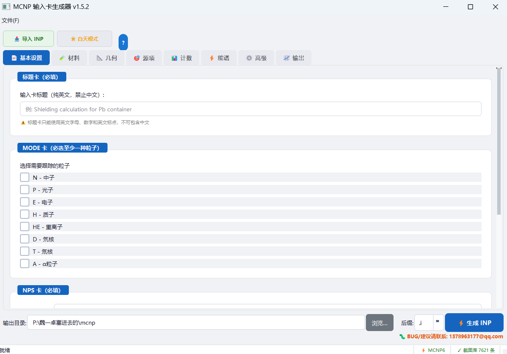

# MCNP 输入卡生成器 — MCNP Input Card Generator

一款基于 **PyQt5** 的桌面应用程序，用于可视化地创建、编辑和校验 **MCNP**（Monte Carlo N-Particle）输入文件（`.INP`）。用结构化、表单化的 GUI 替代手工文本编辑。

A **PyQt5** desktop application for visually creating, editing, and validating **MCNP** input files (`.INP`). Replaces manual text editing with a structured, form-based GUI.




---

## 解决痛点 Why This Tool Exists

MCNP 是核工程领域最权威的蒙卡程序之一，但它的输入卡编写方式停留在上世纪 80 年代——纯文本、固定格式、零容错。本项目专门针对以下痛点：

| 痛点 | 传统方式 | 本项目的方案 |
|------|---------|-------------|
| **格式敏感** | 每行严格 80 列，一个空格错位就 fatal error，调试全靠肉眼 | 表单化 GUI，自动格式化排版，不可能出现列对齐错误 |
| **CAD 几何转换门槛高** | 从 STEP 文件手动提取曲面方程再写成 MCNP 曲面卡，动辄几百行 | 内置 GEOUNED 引擎，一键导入 STEP 文件，自动生成曲面和栅元 |
| **材料定义繁琐** | 翻手册查 ZAID 号、算原子分数、手动拼写 Mm 卡，容易写错截面库 ID | 50+ 种预设材料库 + 化学式自动换算 → ZAID 表格，支持 xsdir 校验 |
| **缺乏可视反馈** | 写完后跑 MCNP plotter 才能看到几何，错了回头改，循环极慢 | PyVista 实时 3D 几何预览，保存前就能确认几何正确性 |
| **输出分析需额外工作** | 跑完 MCNP 后自己写脚本解析输出文件、提取计数、画图 | 内置输出解析器，自动提取 F1–F8 计数结果并绘图，支持 CSV/Parquet 导出 |
| **学习曲线陡峭** | MCNP 手册上千页，卡类型上百种，记不住参数顺序和默认值 | 每个字段都有 Tooltip 提示和格式化输入，参考文档（C810）一键查看 |
| **项目管理混乱** | 多个 INP 文件散落在文件夹里，改了什么版本完全靠文件名 | JSON 项目保存/加载，完整工作区随时恢复 |

---

## 功能特性 Features

| 功能 Feature | 说明 Description |
|-------------|-----------------|
| **表单化编辑 Form-based editing** | 8 个标签页覆盖所有 MCNP 输入段 / 8 organized tabs covering all MCNP input sections |
| **INP 生成 INP generation** | 自动生成标准 MCNP 输入文件，80 列格式排版 / Auto-generates standard MCNP input decks with 80-column formatting |
| **INP 导入 INP import** | 解析现有 `.INP` 文件，回填所有标签页字段 / Parse existing `.INP` files and backfill all tab fields |
| **项目保存/加载 Project save/load** | 以 JSON 格式保存和恢复完整工作区 / Save/restore complete workspace as JSON |
| **材料库 Material library** | 50+ 预设材料（化合物、元素、合金、屏蔽材料、组织、吸收体） / 50+ preset materials |
| **双模式源 Dual source mode** | 固定多源（概率权重）或分布源（SDEF + SI/SP） / Fixed multi-source or distribution source |
| **双模式材料输入 Dual material input** | 手动 ZAID 表格或化学式输入（通过 `pymcnp M_0.from_formula()`） / Manual ZAID table or chemical formula |
| **3D 预览 3D preview** | 基于 PyVista 的几何可视化 / PyVista-based geometry visualization |
| **输出分析 Output analysis** | 解析 MCNP 输出文件，绘制计数结果（matplotlib），导出 CSV/Parquet / Parse output files, plot tallies, export |
| **xsdir 集成 xsdir integration** | 截面库 ZAID 校验与查找 / Cross-section library ZAID validation and lookup |
| **深色/浅色主题 Dark/Light theme** | 内置 QSS 主题切换 / Built-in QSS theme toggle |
| **MCNP 自动检测 MCNP auto-detect** | 自动查找已安装的 MCNP 可执行文件 / Automatically finds installed MCNP executable |

---

## 快速开始 Quick Start

### 环境要求 Prerequisites

- Python 3.10+
- MCNP（可选，用于运行生成的输入文件 / optional, for running generated input decks）

### 安装 Installation

```bash
# 克隆或下载 Clone or download
cd MCNP-Input-Card-Generator

# 安装依赖 Install dependencies
pip install -r requirements.txt

# 运行 Run
python main.py
```

### 打包为独立 EXE Build Standalone EXE

```bash
build.bat
```

打包后的可执行文件输出到 `dist/MCNP输入卡生成器/`。
The packaged executable will be output to `dist/MCNP输入卡生成器/`.

---

## 用户界面 User Interface

| 标签页 Tab | 章节 Section | 说明 Description |
|-----------|-------------|-----------------|
| 基础 Basic | Title, MODE, NPS, CTME | 文件标识与粒子输运参数 / Deck identification and transport parameters |
| 材料 Materials | 材料卡 Material cards | ZAID/份额输入，含预设材料库 / ZAID/fraction entries with preset library |
| 几何 Geometry | 曲面与栅元 Surfaces & Cells | 曲面定义、栅元表格、3D 预览 / Surface definitions, cell table with 3D preview |
| 源 Source | SDEF | 固定点源或分布源模式 / Fixed point sources or distribution source mode |
| 计数 Tallies | F1–F8 | 启用/禁用计数及参数 / Enable/disable tallies with parameters |
| 能量 Energy | E0, CUT 卡 | 能量网格与时间/能量截断 / Energy mesh and time/energy cutoffs |
| 高级 Advanced | PHYS, 其他 | 物理卡、辅助卡、xsdir 路径 / Physics cards, auxiliary cards, xsdir path |
| 输出 Output | 结果 Results | MCNP 输出解析、绘图、导出 / Output parsing, plotting, export |

---

## 项目结构 Project Structure

```
├── main.py                    # 入口文件 Application entry point
├── requirements.txt           # 依赖 Dependencies
├── build.bat                  # PyInstaller 打包脚本 Build script
├── app/
│   ├── main_window.py         # 主窗口协调器 Main window orchestrator
│   ├── models.py              # 数据模型 Data models (DeckData, CellData, etc.)
│   ├── style.py               # QSS 样式表 QSS stylesheets
│   ├── project_io.py          # JSON 项目保存/加载 JSON project save/load
│   ├── inp_importer.py        # INP 文件导入器 INP file importer
│   ├── material_presets.py    # 预设材料库 Preset material library
│   ├── mcnp_detector.py       # MCNP 可执行文件自动检测 MCNP auto-detection
│   ├── xsdir_db.py            # xsdir 截面数据库 xsdir cross-section database
│   ├── xsdir_manager.py       # xsdir 路径管理 xsdir path management
│   ├── tabs/                  # 8 个 UI 标签页 8 UI tab pages
│   ├── dialogs/               # 模态编辑对话框 Modal edit dialogs
│   ├── widgets/               # 可复用组件 Reusable widgets (text mode toggle)
│   └── generator/             # INP 生成与解析引擎 INP generation & parsing engine
│       ├── inp_generator.py   # 主生成器 Main generator (~800 lines)
│       ├── validator.py       # 文件校验 Deck validation
│       └── parsers/           # INP 解析子包 INP file parser subpackage
```

---

## 引用与致谢 Acknowledgements

本项目引用了以下开源软件，谨此致谢：

| 项目 | 用途 | 许可证 |
|------|------|--------|
| [PyQt5](https://www.riverbankcomputing.com/software/pyqt/) | 图形界面框架 | GPL v3 |
| [PyMCNP](https://github.com/FSIBT/PyMCNP) | MCNP 核心库（几何、生成、解析） | BSD-3-Clause |
| [PyVista](https://github.com/pyvista/pyvista) | 3D 可视化 | MIT |
| [matplotlib](https://matplotlib.org/) | 数据绘图 | PSF 风格 |
| [GEOUNED](https://github.com/GEOUNED-org/GEOUNED) | STEP → MCNP 几何转换引擎 | EUPL-1.2 |
| [FreeCAD](https://www.freecad.org/) | 3D CAD 几何处理 | LGPL v2+ |
| [VTK](https://vtk.org/) | 3D 渲染与可视化管线 | BSD-3-Clause |
| [NumPy](https://numpy.org/) | 科学计算 | BSD-3-Clause |
| [SciPy](https://scipy.org/) | 科学计算 | BSD-3-Clause |

GEOUNED 由 UNED（西班牙国立远程教育大学）开发，许可证为 EUPL-1.2（European Union Public Licence）。
GEOUNED is developed by UNED (Universidad Nacional de Educación a Distancia, Spain) and licensed under EUPL-1.2。

---

## 许可协议 License

**All Rights Reserved.** 版权所有 © 2026 魏祎卓

- ✅ 允许个人及机构内部**免费使用**
- ✅ 允许为自用或内部使用**修改代码**
- ❌ **严禁任何形式的盈利活动**（销售、付费服务、商业嵌入等）
- ❌ 修改后公开发布须**经作者书面许可**

如需授权请联系：1378963177@qq.com

---

> 本项目由 AI 辅助编程完成 / Built with AI assistance (Claude).

Built with [PyQt5](https://www.riverbankcomputing.com/software/pyqt/) and [pymcnp](https://pypi.org/project/pymcnp/).
