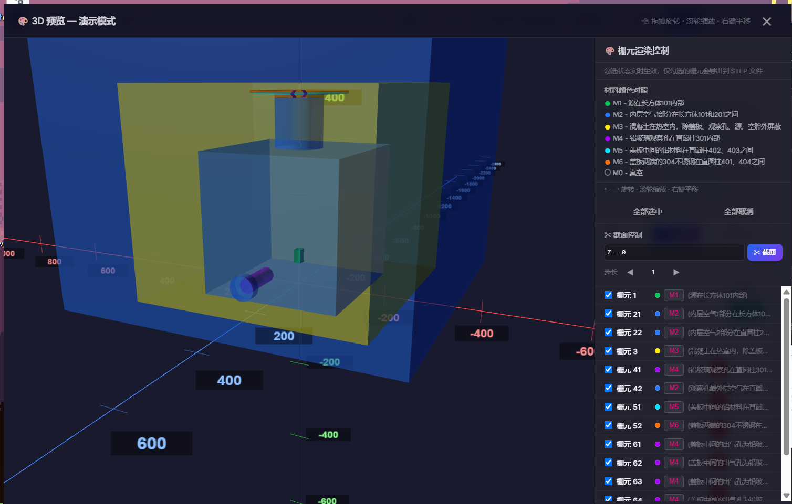
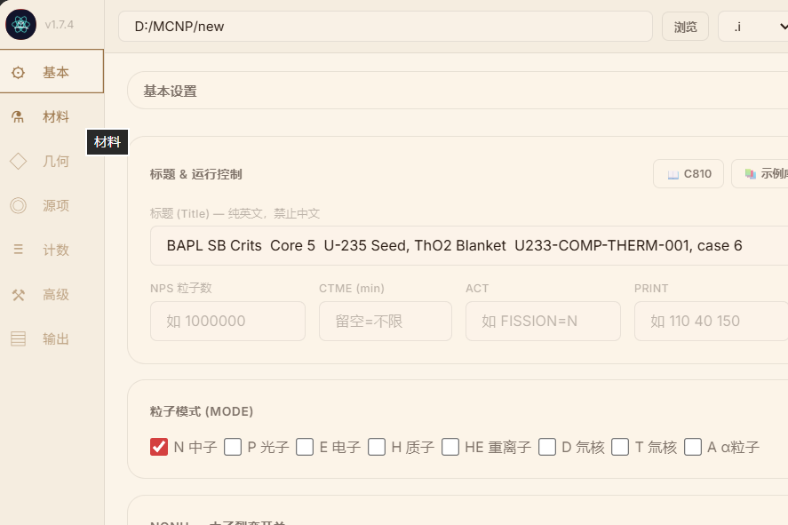
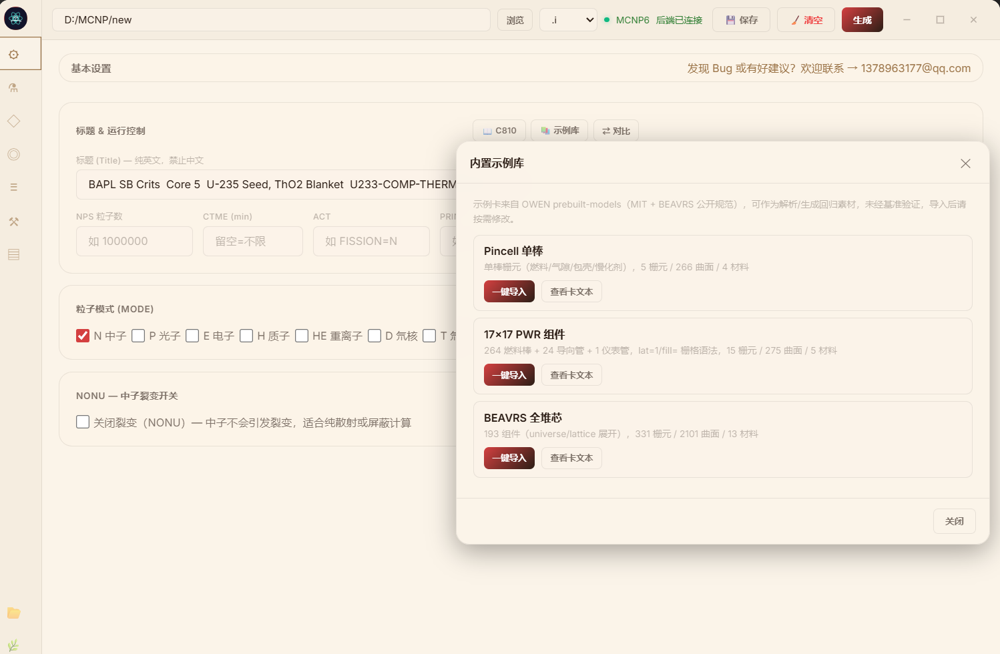
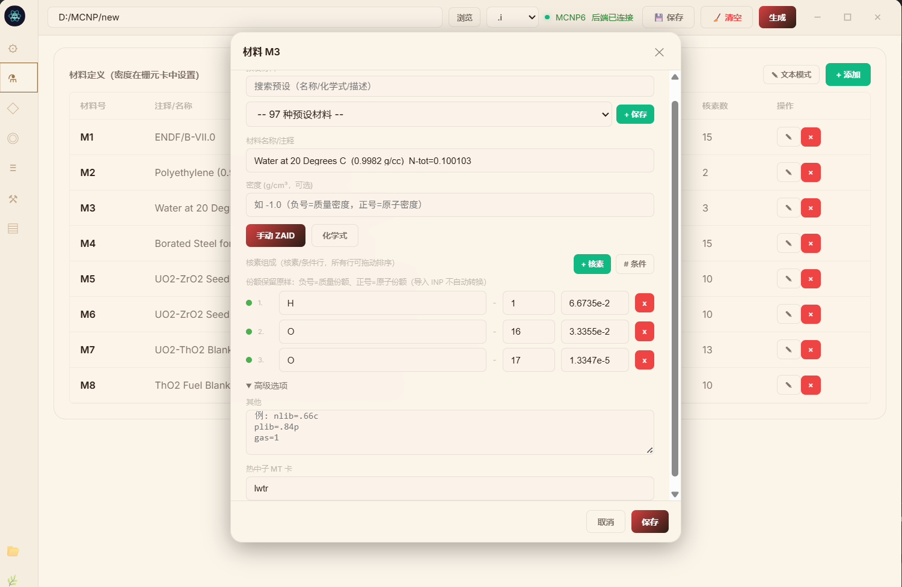
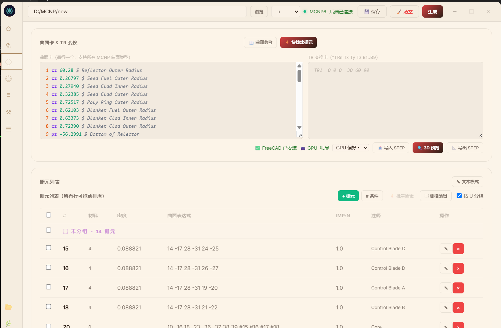
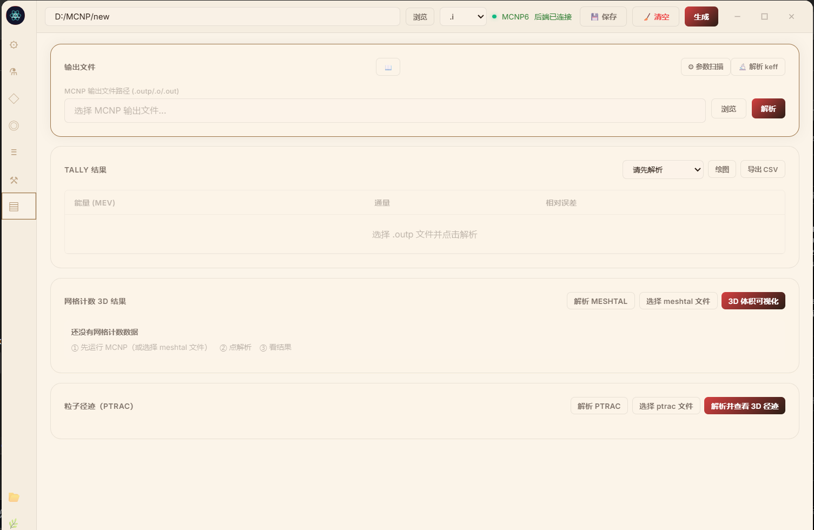

# MCNP 输入卡生成器 — MCNP Input Card Generator

> **商标声明 / Trademark Notice**：MCNP®（Monte Carlo N-Particle）是 Triad National Security, LLC（运营 Los Alamos National Laboratory 的机构）的注册商标。本项目是一个**独立的第三方工具**，用于生成 MCNP 输入文件，**与 Triad National Security, LLC / Los Alamos National Laboratory 无任何关联、无背书、非其官方产品**。项目名称中的 "MCNP" 仅用于描述本工具的用途（生成 MCNP 输入文件），不表示与 MCNP 官方存在隶属或代理关系。

一款用于可视化创建、编辑、校验 **MCNP**（Monte Carlo N-Particle）输入文件（`.INP`）的桌面应用。用结构化、表单化的 GUI 替代手工文本编辑，内置 3D 几何预览、平面截面、材料库、能量/时间网格等工具。

A desktop application for visually creating, editing, and validating **MCNP** input files (`.INP`). Replaces manual text editing with a structured, form-based GUI, with built-in 3D preview, cross-section view, material library, and energy/time grids.

> English: MCNP® is a registered trademark of Triad National Security, LLC (operator of Los Alamos National Laboratory). This project is an **independent third-party tool** for MCNP input file creation and is **not affiliated with, endorsed by, or an official product of** Triad National Security, LLC / Los Alamos National Laboratory. "MCNP" is used herein solely to describe the tool's purpose.

<div align="center">
  
  <br/>
  
  <br/>
  
  <br/>
  
  <br/>
  
  <br/>
  
</div>


---

## AI 接入（inputcard-mcp）

支持 MCP 的 AI 助手可通过 **`inputcard-mcp`** 直接读取、修改、生成 MCNP 输入卡（`.INP`）。无需复制粘贴文件内容——注册一次 MCP 服务，AI 会自动发现这些工具。

- 详细说明（接入配置、工具清单、给 AI 的入口提示）：**[docs/inputcard-mcp.md](docs/inputcard-mcp.md)**
- 服务命名刻意避开 "MCNP" 子串，以免与 MCNP® 及本工具内已有 `mcnp_*` 文件混淆。

## 技术栈 Tech Stack

| 层 | 技术 |
|----|------|
| **前端 UI** | React + TypeScript + Vite（表单化标签页界面） |
| **3D 渲染** | Three.js（3D 预览）/ SVG（平面截面） |
| **窗口外壳** | Tauri（无边框自定义窗口：拖拽、缩放、最小化/最大化/关闭、圆角） |
| **后端** | Python（api_server：INP 解析/生成/校验/3D/截面），FreeCAD 做 CSG 几何 |
| **构建** | Vite（前端）→ Tauri（exe）+ PyInstaller（Python 后端 sidecar） |

---

## 功能特性 Features

| 功能 Feature | 说明 Description |
|-------------|-----------------|
| **表单化编辑 Form-based editing** | 8 个标签页覆盖所有 MCNP 输入段 |
| **INP 生成 / 导入 INP generation/import** | 自动生成标准输入卡（含注释、En/Tn/E0/T0 网格）；拖入或对话框导入 `.INP/.I/.TXT`，解析后一次性回填所有字段 |
| **文本 ↔ 表单双向互转** | 材料/几何/计数支持一键在"表单"与"原始文本"间切换，互转不丢数据 |
| **3D 预览 / 截面** | FreeCAD 精确几何渲染，独立窗口边编辑边看；截面由 STL 直接切出，支持 `#n` 栅元补集 |
| **格阵 3D 装配** | 嵌套 fill 展开 + InstancedMesh 实例化渲染全堆芯；按 MCNP「窗口」机制裁剪（实体 = universe ∩ 格元盒 ∩ 容器 cell），不超壳、无虚假外块；3D 预览侧边栏按 U 分组显示（+ 保留未分组栅元） |
| **STEP 导入（GEOUNED）** | `.STEP/.STP` 经 FreeCAD + GEOUNED 自动转换为 MCNP 曲面/栅元 |
| **材料库 Material library** | 50+ 预设 + 48 PNNL-15870 同位素级（97 种）+ **用户可编辑持久材料库**（自定义保存 / 导入导出 JSON·CSV / 恢复原始，存 `D:\MCNP\material`）；化学式换算，xsdir 校验 + 反向索引 + 组成自洽校验 |
| **源模式 Source modes** | 固定多源 / SDEF 分布源（SI/SP）/ KCODE 临界源 |
| **MCNP 检测与运行** | 自动检测 mcnp6.exe，一键运行、跑完清理临时文件；默认走独显 GPU |
| **输出分析 Output analysis** | 解析 MCNP 输出文件并绘图 |
| **高级特性 Advanced** | 计数乘子 FMn、材料/栅元条件编译行、能谱/时间网格（E0/En/T0/Tn）、栅元拖拽排序、文字内容一键切换 |

---

## 快速开始 Quick Start

### 环境要求 Prerequisites

- **Node.js 18+**（前端构建）
- **Python 3.10+**（后端，含 pymcnp、numpy 等）
- **Rust / Cargo**（仅打包 Tauri exe 时需要）
- **FreeCAD ≥ 0.20**（3D 预览/截面/STEP 导入用，检测到才启用）

### 开发运行 Run in Dev

```bash
# 前端（Vite，端口 1420）
cd gui
npm install
npm run dev

# 后端（api_server，端口 5001）
cd gui/backend
python api_server.py
```

浏览器打开 `http://localhost:1420`。

### 打包为 EXE Build Standalone EXE

> 打包为 EXE 请按 **`docs/手动打包方法.md`** 分步操作（`release.bat` / `scripts\release.ps1` 一键脚本已废弃删除）。
> 流程：vite 构建 → PyInstaller 打包后端 sidecar → 替换 `src-tauri/binaries/` → Tauri 构建 → 复制产物到交付目录 → 冒烟验证。

打包产物在 `gui/src-tauri/target/release/`（`bundle.active=false`，`bundle/` 目录为空属正常）。运行 exe 时前端自动拉起后端、关闭时一起退出。

---

## 用户界面 User Interface

| 标签页 Tab | 章节 Section | 说明 Description |
|-----------|-------------|-----------------|
| 基础 Basic | Title, MODE, NPS, CTME | 文件标识与粒子输运参数 |
| 材料 Materials | 材料卡 Material cards | ZAID/份额输入，含可编辑材料库（📚 入口） |
| 几何 Geometry | 曲面与栅元 Surfaces & Cells | 曲面定义、栅元表格、3D 预览、截面、STEP 导入 |
| 源 Source | SDEF / 固定源 / KCODE | 三种源模式 |
| 计数 Tallies | F1–F8 | 计数及 En/Tn 网格 |
| 高级 Advanced | PHYS, CUT, 其他 | 物理卡、粒子截断、辅助卡、xsdir 路径 |
| 输出 Output | 结果 Results | MCNP 输出解析、绘图、导出 |

---

## 项目结构 Project Structure

```
├── app/                            # Python 核心（生成/解析/校验引擎）
│   ├── generator/                  # inp_generator、parsers、validator
│   ├── models.py                   # 数据模型 (DeckData, CellData, ...)
│   ├── freecad_preview.py          # FreeCAD 3D 预览封装
│   ├── _freecad_csg_worker.py      # FreeCAD CSG 几何求值子进程
│   ├── geouned_worker.py           # GEOUNED 转换 worker（FreeCAD python 子进程）
│   ├── step_importer_geouned.py    # GEOUNED 转换器封装
│   ├── freecad_locator.py          # FreeCAD 定位（检测/手动指定路径唯一入口）
│   ├── stl_cross_section.py        # 从 STL 切平面（numpy，截面用，不依赖 FreeCAD）
│   ├── xsdir_db.py                 # xsdir 截面数据库
│   ├── material_library.py         # 用户材料库持久化（custom/override、导入导出、xsdir 反向索引、组成自洽）
│   └── material_presets.py         # 预设材料库
└── gui/
    ├── src/                        # React 前端
    │   ├── App.tsx                 # 主界面（顶栏/导入/生成/保存恢复）
    │   ├── components/             # 标签页与对话框
    │   │   ├── BasicSettings / GeometryTab / MaterialTab / SourceTab / TallyTab / AdvancedTab / OutputTab
    │   │   ├── Preview3D.tsx       # 3D 预览（Three.js + 材料着色）
    │   │   ├── CrossSectionView.tsx# 平面截面
    │   │   ├── MaterialPanel.tsx   # 材料图例 + 栅元列表（共享组件）
    │   │   └── GridEditor.tsx      # E0/En/T0/Tn 网格编辑器
    │   ├── utils/
    │   │   ├── DeckContext.tsx     # 单一权威表单状态
    │   │   ├── gridState.ts        # 网格解析/序列化深模块
    │   │   ├── backend.ts          # 后端生命周期（启动/关闭 sidecar）
    │   │   └── materialColors.ts   # 材料颜色单一来源
    │   └── styles/global.css       # CSS 变量（4 主题）
    ├── backend/
    │   ├── api_server.py           # HTTP 后端（生成/解析/3D/截面/运行）
    │   ├── mcnp_bridge.py          # 打包后 sidecar 启动器（拉起 api_server）
    │   └── xsdir_db.py
    ├── src-tauri/                  # Tauri 窗口外壳
    │   ├── tauri.conf.json         # 无边框窗口、sidecar 配置
    │   └── icons/
    └── electron/                   # （备用）Electron 外壳
```

---

## 引擎说明 Engine Notes

### 3D 预览（FreeCAD CSG）

- 以 JSON AST 序列化 pymcnp 几何树，FreeCAD 子进程用 `Part.Shape` 布尔运算求值
- 支持 `#n` 栅元补集算子（如空心反射体），输出 STL 网格按材料着色
- 3D 预览与截面均为独立窗口；截面直接从保留的 STL 切（numpy），不重新调 FreeCAD

支持的曲面：P, PX/PY/PZ, S/SO/SX/SY/SZ, C/X/C/Y/C/Z, CX/CY/CZ, K/X/K/Y/K/Z, KX/KY/KZ, SQ, GQ, RPP, RCC, SPH, BOX, TRC, REC, WED, ARB 等，支持 TRn 坐标变换。

### STEP 导入（GEOUNED）

「几何」标签页 → 「导入 STEP」，经 **GEOUNED**（西班牙 CIEMAT 开发，EUPL-1.2）转换：
- 随程序打包、无需单独安装；运行时经 FreeCAD Python 调用，**用户仅需另装 FreeCAD**
- 自动转换并回填曲面/栅元卡，科学计数法自动整理为 3 位小数（GQ/SQ 保留精度）

---

## 引用与致谢 Acknowledgements

| 项目 | 用途 | 许可证 |
|------|------|--------|
| [React](https://react.dev/) | 前端 UI 框架 | MIT |
| [Vite](https://vitejs.dev/) | 前端构建工具 | MIT |
| [Tauri](https://tauri.app/) | 桌面窗口外壳 | MIT/Apache-2.0 |
| [Three.js](https://threejs.org/) | 3D 渲染 | MIT |
| [OWEN](https://github.com/BelvoirDynamics) | MCNP 全堆芯 3D 预览参考（格阵 fill 位置 / 轴向折叠 / disc 降级 / LOD 预算 `budget.ts`、`codes/mcnp.ts`） | MIT (© 2026 BelvoirDynamics) |
| [PyMCNP](https://github.com/FSIBT/PyMCNP) | MCNP 核心库（几何、生成、解析） | BSD-3-Clause |
| [FreeCAD](https://www.freecad.org/) | 3D CAD 几何处理（CSG 求值引擎） | LGPL v2+ |
| [GEOUNED](https://geouned-org.github.io/GEOUNED/) | STEP → MCNP 几何转换引擎（随程序打包） | EUPL-1.2 |
| [OpenCascade](https://dev.opencascade.org/) | CAD 内核（FreeCAD 依赖） | LGPL v2.1 |
| [NumPy](https://numpy.org/) | 科学计算 | BSD-3-Clause |

---

## 许可协议 License

本项目自有代码以 [**MIT License**](LICENSE) 发布。版权所有 © 2026 魏祎卓 (Wei Yizhuo)。

> **MIT 许可仅适用于本项目自有代码。** 任何人可自由使用、复制、修改、合并、发布、分发、再许可、销售本软件，但必须在所有副本中保留此版权声明与许可声明（详见 `LICENSE` 文件）。
>
> 项目所捆绑/调用的开源组件保留其各自许可证：GEOUNED（EUPL-1.2）、OpenCascade（LGPL v2.1）、FreeCAD（LGPL v2+）、pymcnp（BSD-3-Clause）、React（MIT）、Vite（MIT）、Tauri（MIT/Apache-2.0）、Three.js（MIT）、NumPy（BSD）等，详见上方"引用与致谢"。"引用与致谢"列出的第三方许可是各组件自身的许可，与本项目代码的 MIT 许可不同，使用时请分别遵守。

如有问题或合作，可联系：1378963177@qq.com

---

> 本项目由 AI 辅助编程完成 / Built with AI assistance (Claude).
> AI接手可以读取"PROJECT_MEMORY.md"文件
>
> Built with [React](https://react.dev/), [Vite](https://vitejs.dev/), [Tauri](https://tauri.app/), and [pymcnp](https://pypi.org/project/pymcnp/).
