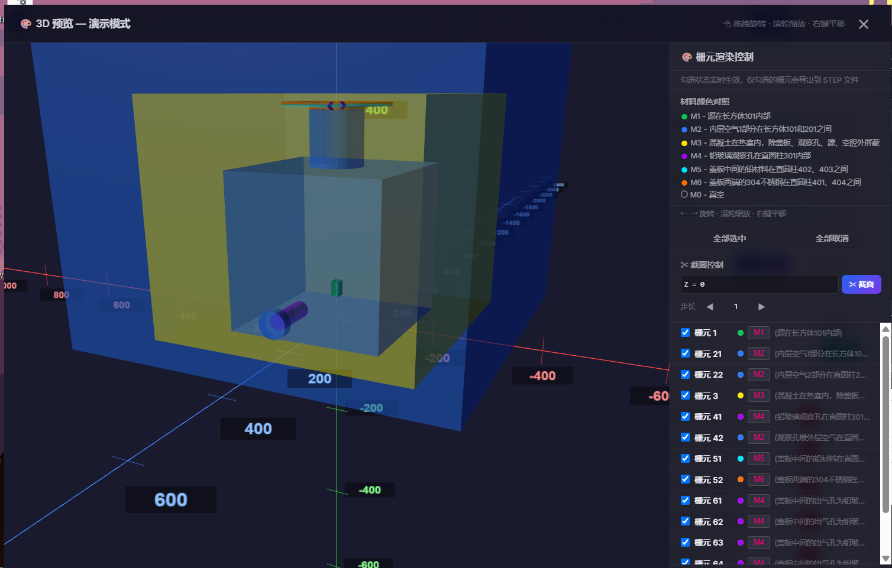
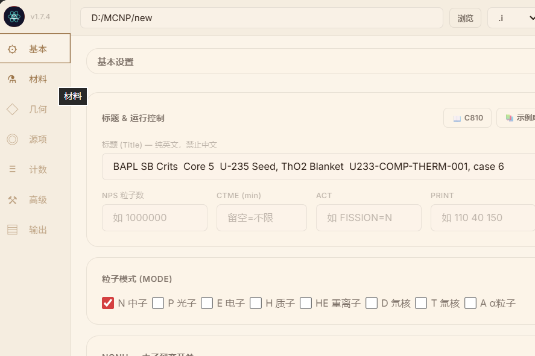
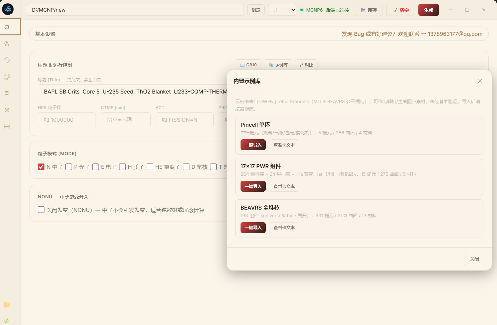
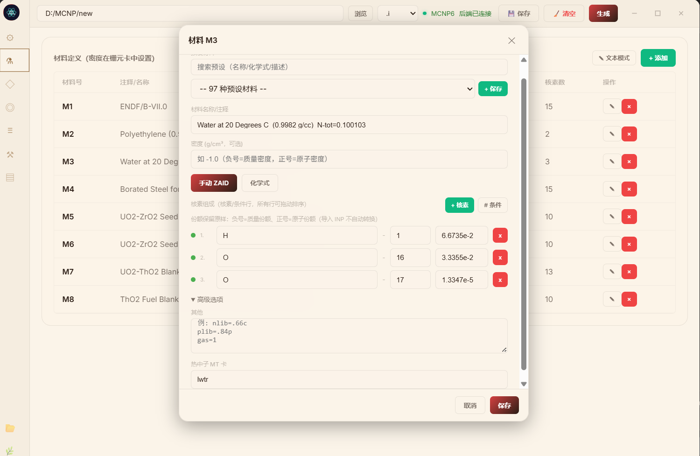
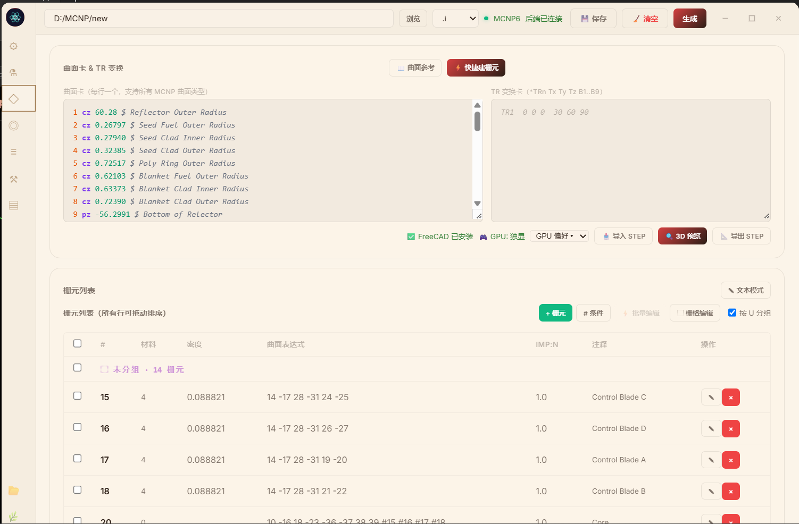
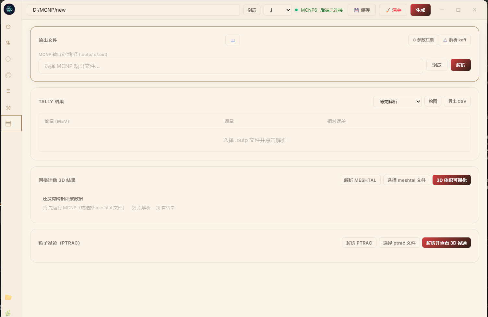

# MCNP 输入卡生成器 — MCNP Input Card Generator

> **商标声明 / Trademark Notice**：MCNP®（Monte Carlo N-Particle）是 Triad National Security, LLC（运营 Los Alamos National Laboratory 的机构）的注册商标。本项目是一个**独立的第三方工具**，用于生成 MCNP 输入文件，**与 Triad National Security, LLC / Los Alamos National Laboratory 无任何关联、无背书、非其官方产品**。项目名称中的 "MCNP" 仅用于描述本工具的用途（生成 MCNP 输入文件），不表示与 MCNP 官方存在隶属或代理关系。

一款用于可视化创建、编辑、校验 **MCNP**（Monte Carlo N-Particle）输入文件（`.INP`）的 Windows 桌面应用。用结构化、表单化的 GUI 替代手工文本编辑，内置 FreeCAD 精确几何的 **3D 预览 / 平面截面 / 体数据可视化**、**STEP(CAD) → MCNP 几何转换**、材料库、源粒子演示、参数扫描与出图工具。

A desktop application for visually creating, editing, and validating **MCNP** input files (`.INP`). Replaces manual text editing with a structured, form-based GUI, with built-in 3D preview, cross-section view, CAD→MCNP geometry conversion, material library, and energy/time grids.

> English: MCNP® is a registered trademark of Triad National Security, LLC (operator of Los Alamos National Laboratory). This project is an **independent third-party tool** for MCNP input file creation and is **not affiliated with, endorsed by, or an official product of** Triad National Security, LLC / Los Alamos National Laboratory. "MCNP" is used herein solely to describe the tool's purpose.

<div align="center">
  
  <br/>
  
  <br/>
  
  <br/>
  
  <br/>
  
  <br/>
  
</div>


---

## 目录

- [交付包直接用（Windows）](#交付包直接用windows)
- [功能特性](#功能特性)
- [界面：7 个标签页 / 6 个独立窗口](#界面7-个标签页--6-个独立窗口)
- [从源码运行与打包](#从源码运行与打包)
- [使用要点与排错](#使用要点与排错)
- [AI 接入（inputcard-mcp）](#ai-接入inputcard-mcp)
- [内置中文参考文档](#内置中文参考文档)
- [引擎说明](#引擎说明)
- [项目结构](#项目结构)
- [引用与致谢](#引用与致谢)
- [许可协议](#许可协议)

---

## 交付包直接用（Windows）

**只需要 Windows 10/11 x64** —— 界面运行时（WebView2）已随包分发（与 exe 同级的 `WebView2\`，**裁剪版 433.7 MB / 29 文件**：官方固定版运行时里与本程序无关的语言包/DRM/内置 PDF/Copilot 等已剔除，见 [`docs/手动打包方法.md`](docs/手动打包方法.md) §6.5）。

- **不需要**装 Edge / 装 WebView2 Runtime（自带；缺失时才回退系统运行时）
- **不需要**联网、**不需要**管理员权限
- 双击 `MCNP 输入卡生成器.exe` 即可；前端会自动拉起内置后端（本机 `127.0.0.1:5001`），关闭主程序时一并退出
- **选装**：**FreeCAD ≥ 0.20**（3D 预览 / 截面 / STEP 导入要用；装了就启用，没装只是这几种能力不可用）
- **选装**：**MCNP6.x**（要"一键运行 + 输出解析"才需要；程序会自动检测 `mcnp6.exe`，装了两个版本可在顶栏切换）

**遇到任何"起不来/一闪就没/后端没起来"，先双击交付目录里的 `自检.bat`**（用户自助诊断，与 exe 同级）。它会打印交付件在位情况、界面运行时判定、引导自检（真启动一次 sidecar，用完即退、不占端口）、5001/8100 端口占用，最后给一句 ASCII 结论：

| `[RESULT]` | 含义与处置 |
| :--- | :--- |
| `BACKEND-RUNNING` | 后端其实在跑，去查主程序界面 |
| `PACKAGE-OK-BACKEND-NOT-UP` | 包是好的，后端没起来：查杀软是否拦 `python.exe` |
| `PKG-INCOMPLETE` | 少了 `_internal\`（三件套要整目录拷） |
| `PKG-INCOMPLETE-OR-BLOCKED` | 三件套不全或被安全软件清理 |
| `WEBVIEW2-MISSING` | 少了 `WebView2\`（只拷了 exe、没拷目录的典型症状） |

---

## 功能特性

### 输入与编辑

| 功能 | 说明 |
| :--- | :--- |
| **表单化编辑** | 7 个标签页覆盖全部 MCNP 输入段：基本 / 材料 / 几何 / 源项 / 计数 / 高级 / 输出 |
| **生成 / 导入 INP** | 生成标准输入卡（含 `C` 与 `$` 注释）；导入走 Windows 原生对话框或**直接把文件拖进窗口**，解析后一次性回填所有字段 |
| **文本 ⇄ 表单双向互转** | 材料 / 栅元 / 计数 / 源卡都能一键在「表单」与「原始文本」间切换，互转不丢数据 |
| **卡片编辑器** | 曲面卡 / TR 卡用 **Monaco** 编辑：曲面号、TR 引用、曲面类型（含宏体）分色高亮 + 缺参数幽灵提示 + 补全；**Monaco 随包、字体走系统栈 ⇒ 断网可用** |
| **条件编译行** | 材料 / 栅元支持 `#ifdef / #else / #endif` 原样行，所有行可**拖拽排序**（含按 U 分组） |
| **工作区** | 关闭自动保存、手动保存、一键清空；重开自动恢复（主题与导入设置独立记忆，不受「清空」影响） |
| **辅助工具** | 示例库一键导入、与当前工作区**差异对比**、栅元批量编辑、材料下拉（选中自动填密度） |

### 几何与 3D

| 功能 | 说明 |
| :--- | :--- |
| **3D 预览（FreeCAD CSG）** | 以 JSON AST 传 pymcnp 几何树，FreeCAD 子进程 `Part.Shape` 布尔求值 → STL；支持 `#n` 栅元补集、`TRn` 变换；按材料着色 + 图例 + 单元格显隐、半透明/色块总览 |
| **独立窗口边编辑边看** | 3D 预览是独立窗口；主窗口里改几何、窗口里即时看（材料改号也双向同步） |
| **格阵 3D 装配** | 嵌套 `fill` 展开 + `InstancedMesh` 实例化渲染全堆芯；按 MCNP「窗口」机制裁剪（实体 = universe ∩ 格元盒 ∩ 容器 cell），不超壳、无虚假外块；侧栏按 U 分组显示 |
| **平面截面** | 从保留的 STL 直接切（numpy，不重新调 FreeCAD）；独立窗口、可拖动、悬停读数、导出矢量图 |
| **体数据可视化** | MESHTAL / FMESH 网格结果 3D 渲染（体绘制 + 切片 + 色标 + 下采样），另有切片导出面板 |
| **几何自检** | ① **栅元封闭性**：每个栅元判定 `closed / infinite / semi_infinite / empty`，表格内实时显示；② **重合检测**：AABB 候选 + FreeCAD 精确布尔 + GQ/SQ 采样探针，按严重度分级，点击高亮对应栅元 |
| **快捷建栅元** | RCC 圆柱（环×段切分）/ SPH 球壳 / RPP 六面体（含倾斜角）/ RHP 六棱柱 / TET 四面体；场景内**线框预览**、**自动生成曲面卡与栅元卡**、生成前**重合检测 + 补集决策**（新挖空 / 已有挖空 / 只占真空） |
| **格阵编辑器** | 填 `fill` 范围 / dims / 格元与 `lat`；**自动生成 RPP / RHP 宏体卡**（六棱柱外接半径按格阵范围推导）+ 子预览 |
| **STEP（CAD）导入** | 见下方 [STEP 导入（GEOUNED）](#step-导入geouned) |
| **STEP 导出** | 把当前 MCNP 几何反向导出为 CAD 模型（含上轴/方位/原点约定 + 方向预览） |

### 源项与计数

| 功能 | 说明 |
| :--- | :--- |
| **源项四模式** | SDEF 分布源（`SI/SP/SB/DS/SC` 结构化表单 ⇄ 原文直通双态）/ 固定多源列表 / KCODE 临界源（+ KSRC 点表）/ 面源 `SSW`·`SSR` |
| **源粒子演示** | 按当前 SDEF + `SI/SP/SB/DS` 抽样 500 个粒子，在独立窗口 3D 显示（先校验"源的位置形态"是否已指定，避免全叠在原点） |
| **计数卡** | `F1–F8`（含 `*`/`+` 前缀、`FIP/FIR/FIC` 特殊前缀、`F5` 环探测器轴）+ `FMn` 乘子 + 每计数独立 `En/Tn` |
| **网格卡片** | 全局 `E0/En/T0/Tn` + FMESH，三模式（线性 / 对数 / 自定义），token 化校验与 FMESH 语义校验 |
| **高级卡** | `PHYS`、`CUT`、`PRINT`、`KCODE` 相关、其他辅助卡与 xsdir 路径 |
| **参数扫描** | 选定参数批量扫描 + 结果看板 + 汇总导出（另有扫描对话框可手工列取值） |

### 材料库

| 功能 | 说明 |
| :--- | :--- |
| **常用预设** | **49 条 / 6 类**（常见化合物、纯元素、合金 & 特殊材料、屏蔽材料、组织等效材料、中子慢化·吸收），含**化学式 → 核素组成换算** |
| **PNNL-15870 同位素级** | **48 条 / 7 类 / 覆盖 133 种核素**（质量份额，负号形式），来源与出处写在数据文件头 |
| **用户可编辑持久库** | 内置 ⊕ 自定义 ⊕ 覆盖 三态；保存 / 导入导出 JSON·CSV / 恢复原始；存于 `D:\MCNP\material`（与工作区清空互不影响） |
| **校验** | xsdir 校验 + 反向索引 + **组成自洽校验**（份额归一、核素可查） |

### 运行与分析

| 功能 | 说明 |
| :--- | :--- |
| **一键运行 MCNP** | 自动检测 `mcnp6.exe`（多版本可切换、可手动指定）；跑完清理临时文件；支持多核 `tasks` |
| **输出解析** | 解析 `outp` / `meshtal` / keff 结果（keff 解析为独立玻璃卡），表格 + 曲线（recharts） |
| **出图导出** | 图与截面可导出 **PNG / PDF / SVG**（中文字体嵌入、论文配色主题、可切白底/透明底） |
| **PTRAC 径迹可视化** | 径迹 3D 渲染（抽稀 + 类型配色 + 交互窗口） |
| **内置参考文档** | 8 篇中文参考（C810 卡片格式、曲面卡格式、源分布卡、FMESH、FN 卡、输出卡结构与 PRINT 等）一键查看 |

### 工程化

| 功能 | 说明 |
| :--- | :--- |
| **断网可用** | 运行时**零外部主机**：Monaco 随包（不走 CDN）、字体走系统栈；已加离线回归测试（扫 `gui/src` 的远程外链） |
| **4 套主题** | 夜之城（霓虹暗色）/ 青空（浅色）/ 多巴胺（高饱和）/ 护眼，主题独立持久化 |
| **全局等比缩放** | 整壳缩放（下拉浮层与子弹框都跟随），适配高分屏/投影 |
| **随包运行时** | WebView2 固定版随包（裁剪 433.7 MB / 29 文件），无 Edge 的机器也能开 |
| **自检与打包链** | `自检.bat` 用户自助诊断；`npm run build:release` 一键出包（sidecar → binaries → vite → tauri → WebView2 铺设与裁剪 → 自检），产物一致性有机器级对拍（见打包手册） |
| **AI 接入** | 见 [AI 接入（inputcard-mcp）](#ai-接入inputcard-mcp) |

### STEP 导入（GEOUNED）

「几何」标签页 →「导入 STEP」，`.STEP/.STP` 经 **FreeCAD + GEOUNED**（西班牙 CIEMAT 开发，EUPL-1.2；**随程序打包**）自动转换为 MCNP 曲面/栅元：

- **导入设置 4 个子页签**（基本 / 常用调节 / 进阶与少见 / 高危 ⚠），共 **43 项 GEOUNED 参数**可调（真空栅元切割三件套、栅元化简、样条处理、几何容差等），另有 9 项本程序自用设置（材料名 / 密度 / TMP / 实体预分解 / 坐标约定）
- **每个参数的 `?` 悬停显示中文详细释义**（作用、调大调小的后果、对应 GEOUNED 参数名、留空含义）
- **留空 = 用 GEOUNED 自己的默认值**（不是传 0）；**设置会被记住**（独立本地键，点「🧹 清空」也不丢；「全部恢复默认」是唯一清除入口）
- **实体预分解**（默认关）：先用 FreeCAD 把实体按**每块面数上限**（**可自己键入**，如 30）切开再交给 GEOUNED —— 实测 274 m³ 厂房模型（3 实体，原面数 27/41/202）上限 30 面切成 **18 块**，实体栅元最大面数 **146 → 25**、实体面数合计 **1110 → 367**、体积比 **1.0000000**；切不动会如实报告并原样保留
- **相切退化自动修复**（默认开）：GEOUNED 对"球面与同轴圆柱面半径相等"的退化组合会**丢定界面**（栅元体积暴涨数倍并与邻居重叠）—— 导入前把球面沿径向外移 0.1% 破除退化，做了什么都写在结果提示里（实测 `筒子1.STEP`：栅元 3/4 体积 28268/29424 → **3646.29/3630.43**，与 CAD 实体一致）
- **样条曲面：跳过而不是终止**（默认档）：含样条（NURBS / 旋转面 / 拉伸面）的实体整块不转换、**其余照常**；被跳过的实体序号、曲面类型、面数写进结果提示（也可显式选「停止转换」或「强行翻译」）
- **默认不生成真空栅元**（界面已移除该开关）：只输出实体栅元，不再插入 GEOUNED 的 enclosure / void / 墓区（`Graveyard`）栅元 —— 大装配体下真空栅元常远多于实体栅元（实测同一装配体：9 栅元 → 6 栅元）。⚠️ **代价**：实体之外的空间于是未定义，直接拿这份卡跑 MCNP 会"丢粒子"，需要**自建外部栅元与墓区**（如最外球壳）；确需 GEOUNED 自动生成真空栅元时，用 GEOUNED 本体转换后再导入
- **CAD 坐标约定**：STEP 不带上轴信息，可选上轴（Z/Y）、方位角与原点口径（原本建模 / 体心归零 / 坐底面上），并**内置方向预览**（复用 3D 预览窗口，导入前先看立不立得住）
- 转换产物会**自动回填**曲面/栅元卡；科学计数法统一整理为 3 位小数（`GQ/SQ` 保留原始精度）

---

## 界面：7 个标签页 / 6 个独立窗口

| 标签页 | 覆盖内容 |
| :--- | :--- |
| **基本** | 标题、`MODE`、`NPS`、`CTME` 等粒子输运参数 |
| **材料** | 材料卡（ZAID/份额）、材料库入口、化学式换算 |
| **几何** | 曲面卡与 TR 卡编辑器、栅元表格（封闭性/重合检测状态）、快捷建栅元、格阵编辑器、STEP 导入/导出、3D 预览入口 |
| **源项** | SDEF / 固定多源 / KCODE / 面源（SSW·SSR）+ 源粒子演示 |
| **计数** | `F1–F8`、`FMn`、每计数 `En/Tn`、FMESH、PTRAC |
| **高级** | `PHYS`、`CUT`、网格卡、其他辅助卡、xsdir |
| **输出** | 运行 MCNP、输出解析、结果绘图与出图导出 |

| 独立窗口 | 用途 |
| :--- | :--- |
| **3D 预览** | FreeCAD 精确几何、格阵装配、材料着色、几何自检面板（封闭性/重合检测）、快捷建栅元侧栏 |
| **平面截面** | 从 STL 切平面、拖动与悬停读数、导出矢量图 |
| **体积 3D** | MESHTAL / FMESH 结果体绘制与切片 |
| **PTRAC 径迹** | 径迹 3D 渲染 |
| **计数图** | 计数结果曲线（独立窗口，便于对照） |
| **源粒子演示** | 按当前源卡抽样 500 粒子的 3D 分布 |

---

## 从源码运行与打包

### 环境要求

| 依赖 | 说明 |
| :--- | :--- |
| **Node.js 18+** | 前端构建（`gui/node_modules`） |
| **Python 3.10+** | 后端（pymcnp / numpy 等，见 `requirements.txt`） |
| **Rust / Cargo** | 仅打包 Tauri exe 时需要 |
| **FreeCAD ≥ 0.20** | 3D 预览 / 截面 / STEP 导入（实测 FreeCAD 1.1.1） |
| **PyInstaller** | 仅打包 sidecar 时需要 |

### 开发运行

```bash
# 后端（api_server，端口 5001）
cd gui/backend
python api_server.py

# 前端（Vite，端口 1420）
cd gui
npm install
npm run dev
```

浏览器打开 `http://localhost:1420`。（打包版由 exe 自动拉起 sidecar，开发时手动起后端即可。）

### 门禁

```bash
python -m pytest tests -q          # 后端：解析/生成/校验/几何契约
cd gui && npm run test             # 前端：vitest（含 DOM 用例与 Monaco 逐行着色断言）
cd gui && npm run typecheck        # tsc 两档（应用 + 测试配置）
```

### 打包为 EXE

一步到位：

```bash
cd gui
set RUSTUP_HOME=D:\rust\rustup
set CARGO_HOME=D:\rust\cargo
npm run build:release
```

它按正确顺序串起 **sidecar(PyInstaller) → binaries → vite → tauri → WebView2 铺设与裁剪 → 自检脚本**（顺序写在脚本文件头，勿改乱）。分步流程、交付目录清单、ACL 与冒烟判据见 **[`docs/手动打包方法.md`](docs/手动打包方法.md)**。

产物在 `gui/src-tauri/target/release/`（`bundle.active=false`，`bundle/` 为空属正常）。**交付目录必须有这几件**：`MCNP 输入卡生成器.exe`、`python.exe`、`_internal\`、`WebView2\`、`自检.bat`（另附 `README.md`、`AI接入.md`）。

---

## 使用要点与排错

| 现象 | 原因与处置 |
| :--- | :--- |
| 双击没反应 / 窗口一闪就没 | 界面运行时缺失（WebView2）。先跑 `自检.bat` 看 `[RESULT]`：`WEBVIEW2-MISSING` ⇒ 只拷了 exe 没拷目录 |
| 后端起不来 / 接口全失败 | 杀软拦截 `python.exe`，或 `_internal\` 没跟过去；跑 `自检.bat` 分流 |
| 3D 预览 / 截面 / STEP 导入不可用 | 没装 FreeCAD（或路径未识别）。程序会提示；装 FreeCAD 后在界面里可手动指定路径 |
| 3D 预览"模型缩成针尖"或周围多出大盒子 | 旧版会把墓区（`Graveyard`，球外无界）当实体渲染。1.7.7（2026-10-10 构建起）已修：语义字段随请求下发，墓地/装配容器按规则跳过 |
| 端口被占 | 后端固定用 `127.0.0.1:5001`，AI 接入的 MCP 用 `8100`；两个端口被别的进程占用时会连不上（用 `Get-NetTCPConnection -LocalPort 5001` 查 PID）。⚠️ 已知：关掉主程序后 `--mcp-http`（8100）子进程不会自动退出，需按 PID 清理 |
| 想让编辑器连不上网也能用 | 1.7.7 起 Monaco 与字体全部随包，**断网可用** |
| 材料库想恢复出厂 | 材料库面板 →「恢复原始」（内置预设永不被覆盖，用户条目单独存在 `D:\MCNP\material`） |
| STEP 导入后栅元数变少 | 默认**不生成真空栅元**，只出实体栅元；含样条面的实体会被跳过并在提示里报告实体序号 |

---

## AI 接入（inputcard-mcp）

支持 **MCP** 的 AI 助手可直接读取、修改、生成程序当前工作区的 MCNP 输入卡：

- 服务名 `inputcard-mcp`（**刻意不含 "MCNP" 子串**，避免与 MCNP® 及程序内 `mcnp_*` 文件混淆）
- MCP over HTTP：外部 agent 连 **`http://127.0.0.1:8100/mcp`** 即可（**6 个工具** + 「当前工作区」会话；无状态、完全本地化，数据不出本机）
- 详细接入配置与工具清单：[`docs/inputcard-mcp.md`](docs/inputcard-mcp.md) · 快速上手：[`AI接入.md`](AI接入.md)

---

## 内置中文参考文档

程序内「📖」入口可直接查看（随包分发，不联网）：

| 文档 | 内容 |
| :--- | :--- |
| `C810_卡片格式详细.md` | MCNP 手册卡片格式精读（字段、默认值、示例） |
| `MCNP6_曲面卡格式参考.md` | 全部曲面类型与宏体参数表 |
| `源分布卡说明.md` | SDEF 与 `SI/SP/SB/DS/SC` 语义与写法 |
| `FMESH卡参数填法参考.md` | FMESH 各关键字与取值 |
| `MCNP6_FN卡结构参考.md` | `FIP/FIR/FIC` 等专用卡 |
| `MCNP6_输出卡结构参考.md` | 输出卡结构与解析口径 |
| `PRINT卡说明.md` | `PRINT` 卡表号与用途 |
| `design_hybrid_sisp_interface.md` | 设计与实现说明 |

---

## 引擎说明

### 3D 预览与几何自检（FreeCAD CSG）

- 以 JSON AST 序列化 pymcnp 几何树，FreeCAD 子进程用 `Part.Shape` 布尔求值 → STL（**不是**网格化近似）
- 支持 `#n` 栅元补集算子（如空心反射体）与 `TRn` 坐标变换；GQ/SQ 走体素 CSG 路径
- 按 deck 指纹缓存（几何引擎源码摘要也在指纹里 ⇒ 引擎一改缓存自动失效）
- 支持的曲面：`P, PX/PY/PZ, S/SO/SX/SY/SZ, C/X·C/Y·C/Z, CX/CY/CZ, K/X·K/Y·K/Z, KX/KY/KZ, SQ, GQ, TX/TY/TZ, X/Y/Z` 与宏体 `RPP, SPH, RCC, TRC, REC, ELL, WED, BOX, ARB, RHP/HEX`
- **几何自检**：栅元封闭性（BRep 是否有限体积）+ 重合检测（AABB 索引 → FreeCAD 精确布尔 → 按严重度分级；含"格阵 pin 超出格元盒"这类装配级检查）

### 平面截面与体数据

- 截面直接从保留的 STL 切（numpy，不重新调 FreeCAD），支持 `#n` 补集与悬停读数
- MESHTAL / FMESH 结果以体绘制 + 切片呈现，可导出切片数据

### 材料与核数据

- `xsdir_db.py` 读本机 xsdir：核素校验、反向索引、温度/截面表查询
- 材料库三态（内置 / 自定义 / 覆盖）+ 化学式换算 + 组成自洽校验

---

## 项目结构

```
├── app/                              # Python 核心（解析 / 生成 / 校验 / 几何）
│   ├── generator/                    # inp_generator、parsers、validator、distributions、source_sampler
│   ├── models.py                     # 数据模型（DeckData / CellData / …）
│   ├── freecad_preview.py            # FreeCAD CSG 预览封装（含几何自检、并集退化剔除）
│   ├── _freecad_csg_worker.py        # CSG 求值子进程（FreeCAD python）
│   ├── preview_cache.py              # deck 指纹缓存（STL/重合报告，引擎摘要参与指纹）
│   ├── overlap_probe.py / overlap_classify.py / spatial_index.py   # 重合检测探针与分级
│   ├── stl_cross_section.py          # 从 STL 切平面（numpy，截面用）
│   ├── section_region.py / sweep.py  # 截面区域与参数扫描
│   ├── step_importer.py / step_importer_geouned.py / geouned_worker.py  # STEP → MCNP（GEOUNED）
│   ├── adaptive_decompose.py / adaptive_cut_freecad.py  # 实体预分解（每块面数上限）
│   ├── tangent_fix.py                # 相切退化修复（导入前破除）
│   ├── spline_skip.py                # 样条实体"跳过并报告"的判据
│   ├── cad_orientation.py            # STEP 上轴/方位/原点约定（互逆矩阵）
│   ├── mcnp_locator.py / mcnp_tasks.py / outp_parser.py / mctal_parser.py  # MCNP 检测、运行与输出解析
│   ├── material_library.py / xsdir_db.py / gpu_pref.py
│   └── docs/                         # 随包中文参考文档（程序内「📖」查看）
├── gui/
│   ├── src/                          # React 前端
│   │   ├── App.tsx                   # 主界面（顶栏 / 导入 / 生成 / 工作区）
│   │   ├── components/               # 标签页、对话框、编辑器、预览窗口
│   │   ├── three/ · volume/ · ptrac/ · export/ · source/   # 3D / 体数据 / 径迹 / 出图 / 源演示
│   │   ├── utils/                    # DeckContext（单一权威状态）、backend（sidecar 生命周期）等
│   │   └── styles/global.css         # CSS 变量（4 主题）
│   ├── backend/                      # api_server.py（HTTP 后端）、mcnp_bridge.py（打包入口）
│   ├── test/                         # vitest（含 DOM 与 Monaco 逐行着色）
│   └── src-tauri/                    # Tauri 外壳（无边框窗口 / sidecar / 图标）
├── inputcard_mcp/                    # AI 接入：MCP over HTTP 服务
├── tests/                            # pytest（unit / parser / integration 契约）
├── docs/                             # 打包手册、变更日志、QA 与审计报告
└── images/                           # README 截图
```

---

## 引用与致谢

| 项目 | 用途 | 许可证 |
| :--- | :--- | :--- |
| [React](https://react.dev/) | 前端 UI 框架 | MIT |
| [Vite](https://vitejs.dev/) | 前端构建工具 | MIT |
| [Tauri](https://tauri.app/) | 桌面窗口外壳 | MIT/Apache-2.0 |
| [Three.js](https://threejs.org/) | 3D 渲染 | MIT |
| [Monaco Editor](https://microsoft.github.io/monaco-editor/) | 卡片编辑器（随包，断网可用） | MIT |
| [Recharts](https://recharts.org/) | 结果绘图 | MIT |
| [jsPDF](https://github.com/parallax/jsPDF) + [svg2pdf.js](https://github.com/yWorks/svg2pdf.js) | 出图导出 PDF | MIT |
| [marked](https://github.com/markedjs/marked) | 内置文档渲染 | MIT |
| [OWEN](https://github.com/BelvoirDynamics) | MCNP 全堆芯 3D 预览参考（格阵 fill 位置 / 轴向折叠 / disc 降级 / LOD 预算） | MIT (© 2026 BelvoirDynamics) |
| [PyMCNP](https://github.com/FSIBT/PyMCNP) | MCNP 核心库（几何、生成、解析） | BSD-3-Clause |
| [FreeCAD](https://www.freecad.org/) | 3D CAD 几何处理（CSG 求值引擎） | LGPL v2+ |
| [GEOUNED](https://geouned-org.github.io/GEOUNED/) | STEP → MCNP 几何转换引擎（随程序打包） | EUPL-1.2 |
| [OpenCascade](https://www.opencascade.com/) | CAD 内核（FreeCAD 依赖；实体预分解直接用它） | LGPL v2.1 |
| [NumPy](https://numpy.org/) | 科学计算 | BSD-3-Clause |

---

## 许可协议

本项目自有代码以 [**MIT License**](LICENSE) 发布。版权所有 © 2026 魏祎卓 (Wei Yizhuo)。

> **MIT 许可仅适用于本项目自有代码。** 任何人可自由使用、复制、修改、合并、发布、分发、再许可、销售本软件，但必须在所有副本中保留此版权声明与许可声明（详见 `LICENSE` 文件）。
>
> 项目所捆绑/调用的开源组件保留其各自许可证：GEOUNED（EUPL-1.2）、OpenCascade（LGPL v2.1）、FreeCAD（LGPL v2+）、pymcnp（BSD-3-Clause）、React（MIT）、Vite（MIT）、Tauri（MIT/Apache-2.0）、Three.js（MIT）、Monaco Editor（MIT）、NumPy（BSD）等，详见上方"引用与致谢"。"引用与致谢"列出的第三方许可是各组件自身的许可，与本项目代码的 MIT 许可不同，使用时请分别遵守。

如有问题或合作，可联系：1378963177@qq.com

---

> **版本**：1.7.7（`gui/package.json` / `tauri.conf.json` 为版本单一来源）；逐批变更见 [`docs/CHANGELOG.md`](docs/CHANGELOG.md)，AI 接手请先读 [`PROJECT_MEMORY.md`](PROJECT_MEMORY.md)。
>
> 本项目由 AI 辅助编程完成 / Built with AI assistance (Claude).
>
> Built with [React](https://react.dev/), [Vite](https://vitejs.dev/), [Tauri](https://tauri.app/), [Three.js](https://threejs.org/), and [pymcnp](https://pypi.org/project/pymcnp/).
